## Wanderley Terra

**Desenvolvedor de IA e Automação** — Python · RPA · agentes de voz 
Campo Grande, MS · Brasil

Construo sistemas que colocam IA dentro da operação: transcrição e análise de ligações,
copilotos que orientam atendentes em tempo real e robôs que eliminam trabalho manual repetitivo.

Passei 2 anos e 4 meses na **Portes Advogados** desenvolvendo essas soluções de ponta a ponta —
do pipeline de áudio ao banco, da API à interface — e atuando como referência técnica de
boas práticas de código, segurança e deploy enquanto o escritório inteiro adotava automação.

### Arquitetura que construí

Uma mesma base atende dois momentos: o copiloto que orienta o atendente **durante** a chamada
e a monitoria que avalia **100% das ligações** depois dela. Os critérios de avaliação são
configuráveis pela operação, sem alteração de código.

### O que eu construí

| | |
|---|---|
| **Copiloto de atendimento** | Transcrição ao vivo com orientações contextuais exibidas ao operador durante a chamada. Evoluiu de processamento em lote para streaming com baixa latência. |
| **Monitoria de qualidade** | Transcrição, diarização e avaliação por LLM de todas as ligações, com nota e feedback estruturado — no lugar da amostragem manual. |
| **Agente de voz para cobrança** | Informa ao cliente os valores em aberto e agenda a data de pagamento durante a própria ligação. |
| **Automações RPA** | Robôs em Playwright e Selenium para processos administrativos e jurídicos de alto volume. |

### Stack

| | |
|---|---|
| **Linguagens** | Python · JavaScript · SQL |
| **Back-end** | FastAPI · Uvicorn · SQLAlchemy · APIs REST · autenticação JWT |
| **Front-end** | React |
| **IA aplicada** | APIs de LLM · engenharia de prompt · avaliação automatizada (LLM-as-judge) · agentes de voz |
| **Áudio e voz** | Whisper · OpenAI Transcribe · Azure Speech · Deepgram · diarização · transcrição em tempo real |
| **Automação** | Playwright · Selenium · web scraping |
| **Dados** | MariaDB / MySQL · PostgreSQL |
| **Cloud** | Microsoft Azure · Git e GitHub |

<b>Formação e certificações</b>

 

- Análise e Desenvolvimento de Sistemas — Estácio (2024)
- Técnico em Desenvolvimento de Sistemas — SENAC-MS, HUB Academy / Fábrica de Software (2024)
- Microsoft Certified: Azure Fundamentals (AZ-900)
- Microsoft Certified: Azure Data Fundamentals (DP-900)

### Contato

[LinkedIn](https://www.linkedin.com/in/wanderley-da-silva-terra-1bb84636/) · wanderleyterra@gmail.com

Aberto a oportunidades em IA aplicada, automação e back-end Python.
